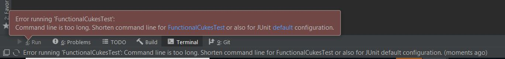

# Framework Troubleshooting
### Issue: Repository blocked from downloading
If download of repository is blocked due to any restrictions, please see the below work arounds in order of convenience:

1.	Upload framework to GitHub and transfer to client machine
1.	Zip-up framework and upload to a shared drive for download
1.	Copy files to notepad and email to client 
      * Please note that if the workarounds are used manual updates will need to be taken from the central repository. 
      * If framework is not routinely kept up to date, the practice may not be able to continue supporting the framework.

### Issue: IntelliJ run button not executing
Below please find the steps to fix the issue:
1.	File -> Settings -> Plugins
1.	Uncheck Gradle

1.	Click Apply
1.	Restart IntelliJ
1.	Click Run
      
### Issue: Maven dependencies not downloading 

#### Alternative method 1 (preferred):
If you are unable to download dependencies directly through the pom, you can manually setup maven by copying the .m2 folder from the SharePoint and exporting it to specified location on your laptop or VDI.
SharePoint link: https://sites.ey.com/:u:/s/TestingiCOP/TestAutomation/EbDwXaiL3zRCr1j_X3746U4BJ8UXbFmWcZ63R1nHk4IueQ
Location to unzip to: C:\Users\{your_username}

If you are unable to download maven at all, you can send over the following Apache.zip.
SharePoint link: https://sites.ey.com/:u:/s/TestingiCOP/TestAutomation/EZo9K4R-KI1DqJn2kyDL_pQBB5IC5IUfqG7mPyUHfsmUxw
Location to unzip to: C:\Program Files

#### Alternative method 2:
If you are unable to download dependencies directly through the pom, you can manually download the dependencies listed at the below link from https://mvnrepository.com/.

**List of dependencies:**
https://sites.ey.com/:w:/s/TestingiCOP/TestAutomation/EWSnYPRJ9RxLmDN_lnByUXkBZ0cOUsrbmdQXtsb7Ko8zGg
Steps to manually add maven dependencies as jars:
1.	Go to https://mvnrepository.com/
1.	Download all dependencies above as jars
1.	Open IntelliJ
1.	File->Project Structure->Modules->Dependencies
1.	Click +
1.	Select Jars or directories
1.	Select Jar file
1.	Click ok
1.	Repeat for all dependencies

#### EY Hosted Dependencies
If the dependencies are from EY like com.ey.xyz refer to the last page in this document about [Using GitHub Hosted Dependencies](Using-a-GitHub-Hosted-Dependency)

### Issue: Failure on running a scenario (Command length is too long etc.)

1. Click Run -> Edit Configurations
2. Open the JUnit or TestNG Configuration you were running
3. On the right side look for the drop-down, 
   `Shorten Command Line:'
4. From the drop down select the last option: `@argfile (Java 9+) - java @argfile classname [args]`

***