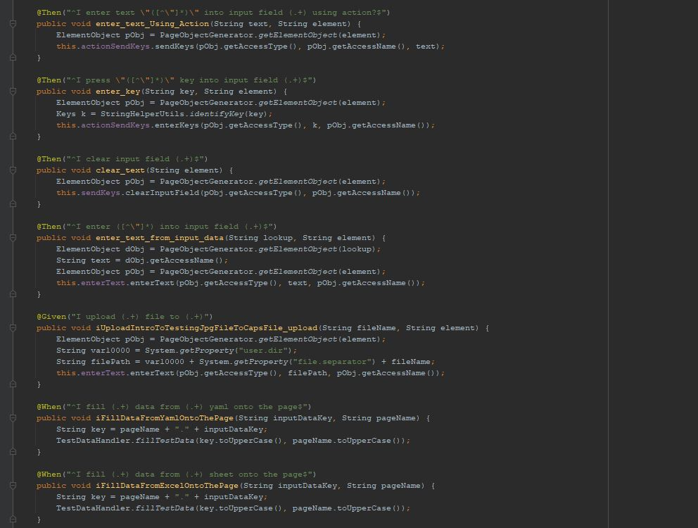

# Next Gen Testing Platform Usage Guide


Next Gen Testing Platform is a behavior driven development (BDD) based test automation framework to test Web, API, Desktop, ETL and many other applications.
It enables you to write and execute automated acceptance/unit tests.
Automate your test cases with minimal coding.
[More Details](http://https://cucumber.io//)

## Table of Contents
<ul>
	<li>
		<a href = "#introduction">Introduction</a>
	</li>
	<li>
		<a href = "#usage">Usage</a>
		<ol>
		    <li><a href = "#run-a-quick-test-to-see-ngtp-in-action">Run a quick test to see NGTP in action</a></li>
			<li><a href = "#new-testing-project">New Testing Project</a></li>
			<li><a href = "#writing-a-test">Writing a test</a></li>
			<li><a href = "#object-repositories">Object Repositories</a></li>
			<li><a href = "#test-data">Test Data</a></li>
			<li><a href = "#environment-properties">Environment Properties</a></li>
			<li><a href = "#reusable-steps">Reusable steps</a></li>
			<li><a href = "#auto-fill-web-forms">Auto-fill Web Forms</a></li>
			<li><a href = "#running-tests">Running tests</a></li>
		</ol>	
	</li>
	<li>
		<a href = "#license">License</a>
	</li>
</ul>
	


## Introduction
The Next Gen Testing Platform is a comprehensive platform to accelerate testing and increase automation ROI through unique capabilities crafted by EY experience, innovation and technology. It is a modular 3-tier Test Automation Harness built using Java. Primarily, it leverages Cucumber and Java to achieve the automation objectives and uses Gherkin Language for writing test scripts that also serves a living documentation of acceptance criteria. The same harness can be used to test a variety of applications ranging from
Web, Windows, API, Mobile to even Accessibility testing.

## Layout
The NGTP consists of 3 layers

- Core Libraries layer - Provides the capabilities and methods to test a specific application type
- Workbench layer - Provides the glue/business logic that connects the steps that the tester writes to the library layer. This layer contains platform/application-specific directives for the testers to test an application type(e.g., SAP, Oracle, GW or even any web/mobile/api apps)
- Application/Business layer - This is the layer where the tester interacts with NGTP. It contains the english-like Gherkin sentences(**Given**...,**When**..., **Then**...) that drive the tests. It also contains external test data and test configurattions

  

## Usage
Once you followed all the steps to successfully install NGTP, you will be able to create new tests, run new tests and also create new testing projects.

### Run a quick test to see NGTP in action
Your NGTP should come with a sample/training project called amazonDemo (unless you are in client projects in which case the framework will be stripped of any external tests). You can run its scenarios as follows
* Navigate to src/test/resources/amazonDemo/features
* All of the scenarios are organized under feature files
* Pick a specific scenario you want to test.
  * Each such scenario will have been tagged with an @xyz tag. Tags, in short are for organizing tests in whichever way the team prefers (Think of instagram/facebook tags)
  * Copy the tag you want to run
* Open src/test/java/methods/FunctionalCukesTest.java
  * Paste/replace the tags with the one you copied

  

  Right click on the class name and select Run FunctionalCukesTest

  

### New Testing Project

- Create a folder for your tests under src/test/resources using the name of your project.
- Add the following folders according to the structure
  > src/test/resources/<your_project>/data
  > src/test/resources/<your_project>/features  
  > src/test/resources/<your_project>/data/inputdata  
  > src/test/resources/<your_project>/data/environments.yaml  
  > src/test/resources/<your_project>/data/<PageObjects.xlsx | PageObjects.yaml | PageObjects.json>
  > - 3 formats of data are supported: xlsx, yaml, json.

    

    - Any step definitions you are writing should go under:

  > src/test/java/seleniumutils/applicationlayer/<your_project>/stepdefinitions/*StepDefinitions.java

    

    - Any Page Object classes you create should go under:

  > src/test/java/seleniumutils/<your_project>/pageobjects/*Page.java

- Open cucumber.properties file and change the setting application = [your project name]

    

- Any feature file you add will go under the features folder or its sub folder within the one created above
- All object locator information will go into the PageObjects.* file created above
- Environments.yaml holds the applications landing page url.
    - Whatever environment you are using for the landing page url, configure that against cucumber.properties' environments setting.

### Writing a test

The cucumber features goes in the `features` library and should have the ".feature" extension. The first line of that file should always be `Feature: [Feature name]`

You can start out by looking at `amazonDemo/features/product_checkout.feature`. You can automate most applications using any of the reusable steps that comes with Next Gen Testing Platform.



### Object Repositories

In Next Gen Testing Platform, page or screen locators are maintained in flat files externally. You can store all your locators in EXCEL, YAML or JSON format. The file name should always be
PageObjects.xlsx/PageObjects.yaml/PageObjects.json
- The locators will be organized in Object-oriented fashion as:

```Page contains elements contains attributes```

Interpreted in xlsx, this will be:

- Page     => sheets  e.g Amazon sheet
- elements => rows 

**Example**

<table>
<tr>
    <th>element_type</th>
    <th>variable</th>
    <th>value</th>
    <th>id</th>
    <th>class</th>
    <th>name</th>
    <th>xpath</th>
    <th>css</th>
    <th>linkText</th>
    <th>partialLinkText</th>
    <th>tagname</th>
</tr>
<tr>
    <td>input</td>
    <td>username</td>
    <td></td>
    <td>Text1</td>
    <td></td>
    <td></td>
    <td></td>
    <td></td>
    <td></td>
    <td></td>
    <td></td>
</tr>
<tr>
    <td>link</td>
    <td>asus_zenbook</td>
    <td></td>
    <td></td>
    <td></td>
    <td></td>
    <td>(//*[contains(text(),'ASUS ZenBook 13')])[1]</td>
    <td></td>
    <td></td>
    <td></td>
    <td></td>
</tr>
</table>


In JSON, this will be:

````json
{
   "Amazon": 
   [
      {
         "element_type": "data",
         "variable": "home",
         "value": "http://www.amazon.com",
         "id": "",
         "class": "",
         "name": "",
         "xpath": "",
         "css": "",
         "linktext": "",
         "partiallinktext": "",
         "tagname": ""
      },
      {
         "element_type": "textbox",
         "variable": "search_bar",
         "value": "",
         "id": "twotabsearchtextbox",
         "class": "",
         "name": "",
         "xpath": "",
         "css": "",
         "linktext": "",
         "partiallinktext": "",
         "tagname": ""
      }
   ],
  "SecurityPage": 
   [
        {
           "element_type": "",
           "variable": "edit_name",
           "value": "",
           "id": "auth-cnep-edit-name-button",
           "class": "",
           "name": "",
           "xpath": "",
           "css": "",
           "linktext": "",
           "partiallinktext": "",
           "tagname": ""
        }
   ]
}
````
In YAML,

````
"Amazon":
  - element_type: data
    variable: home
    value: 'http://www.amazon.com'
    id: ""
    class: ""
    name: ""
    xpath: ""
    css: ""
    linktext: ""
    partiallinktext: ""
    tagname: ""

  - element_type: textbox
    variable: search_bar
    value: ""
    id: twotabsearchtextbox
    class: ""
    name: ""
    xpath: ""
    css: ""
    linktext: ""
    partiallinktext: ""
    tagname: ""
    
"SecurityPage":
  - element_type: ""
    variable: edit_name
    value: ""
    id: auth-cnep-edit-name-button
    class: ""
    name: ""
    xpath: ""
    css: ""
    linktext: ""
    partiallinktext: ""
    tagname: ""
    
  - element_type: ""
    variable: success_verification
    value: ""
    id: ""
    class: ""
    name: ""
    xpath: '//*[@id="auth-success-message-box"]/div/h4'
    css: ""
    linktext: ""
    partiallinktext: ""
    tagname: ""    
````

### Test Data

As with Page Objects, Test data is also supported in the above 3 formats
You can refer to any of the sample projects for the data formats. The path is shared above in the New project section.

   

### Environment Properties

All Test environment properties and run configurations can either be setup through cucumber.properties or added to your POM.xml under the properties tag 
or even fed at runtime through command line options as -D<propertyname>=<value> after your maven command. The exact syntax is highlighted below under Running the test section.
But the mandatory properties are:
- application
- environment
- browser

   

### Reusable steps

By using reusable steps you can automate your test cases more quickly, more efficiently and without much coding.
The reusable steps are located in the etl-step-definitions jar and etaf-step-definitions jar

### Auto-fill Web Forms

With Next Gen Testing Platform you can fill either a single field or an entire page or even multiple pages with a single step using this step

```
I fill (.+) data from (.+) (?:yaml|sheet|json) onto the page
e.g Given I fill personal_details from checkoutpage yaml onto the page
```

Note: For the above example, make sure you do have a dataset called personal_details in your checkoutpage.yaml (or json or excel sheet) to test this example

### Dynamic/Random Data Generation


Next Gen Testing Platform allows you to generate commonly used data like name, addresses Identification informations automatically. You only have to specify either what information you want or what pattern of data you want to be entered into a particular field and then Next Gen Testing Platform automatically generates that information for you.
This helps every test run of yours to be unique.

   

### Running tests

**Terminal**

Go to your project directory from terminal and hit following commands

 ```
    mvn test|install (default will run on local firefox browser)
    mvn test|install "-D<propertyname>=value` e.g `mvn test "-Dbrowser=chrome" (to use any other browser)
    e.g. mvn clean install -Dapplication=amazonDemo
    It will automatically run all the tests under features directory provided the properties in pom.xml are configured appropriately
 ```
 **Alternative:** This command can be configured in a batch file and then simply double-clicking the file will run the scenarios for you. The batch file can also be run using windows scheduler on a regular schedule.

- The following [link](https://www.toolsqa.com/selenium-cucumber-framework/run-cucumber-test-from-command-line-terminal/) explains about more maven commands for running cucumber scenarios

**IDE**
- Open `FunctionalCukesTest.java` located under src/test/java/methods
- Add the tag you want to run under CucumberOptions Annotation
- Click Run button on the top right of your IDE (or from your right click context menu)

    

#### Parallel Execution

***Using Cucable Plugin***

Next Gen Testing Platform uses Cucable plugin to parallelize the execution process. All you have to do is open the pom.xml and update a few settings under the configurations tag of com.trivago.rta cucable plugin highlighted below

````xml
<plugins>
...
			<plugin>
				<groupId>com.trivago.rta</groupId>
				<artifactId>cucable-plugin</artifactId>
				<version>1.5.1</version>
				<executions>
					<execution>
						<id>generate-test-resources</id>
						<phase>generate-test-resources</phase>
						<goals>
							<goal>parallel</goal>
						</goals>
					</execution>
				</executions>
				<configuration>
					<sourceRunnerTemplateFile>src/test/java/methods/CucableJavaTemplate.java</sourceRunnerTemplateFile>
					<sourceFeatures>${project.basedir}/src/test/resources</sourceFeatures>
                    <includeScenarioTags>${tags}</includeScenarioTags>
				</configuration>
			</plugin>
...
</plugins>
````
In the above section, verify if,
 - **sourceRunnerTemplateFile** points to your CucableJavaTemplate.java file
 - **sourceFeatures** points to your feature file directory or its parent
 - **includeScenarioTags** is either commented out (to run all scenarios under the sourceFeatures directory) or has one or more tags that needs to run.

***Using Native Cucumber***

Refer the [remove cucable plugin steps](remove-cucable-plugin-steps) documentation for a step-by-step walk-through on this.

## License

© 2020 Ernst & Young LLP. All Rights Reserved. Any unauthorized use or disclosure is strictly prohibited.

***