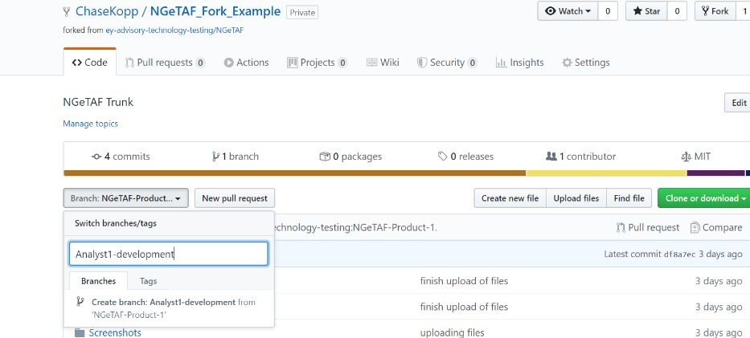
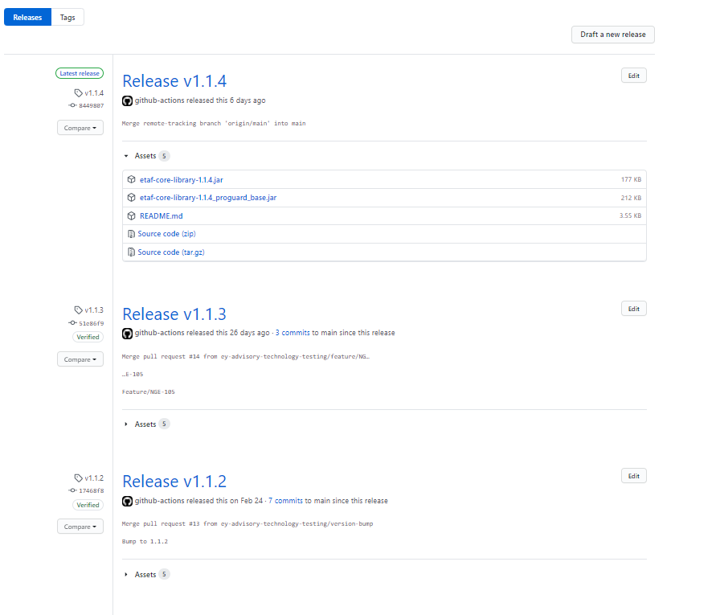

# GitHub Usage Guidelines
## Setting Up Your GitHub Account

- First go to [www.github.com](http://www.github.com/) and create a free account **using your EY email** (must use EY email in order to gain access to the EY GitHub organization)


- After you create/own a GitHub account, an owner/admin of the EY advisory technology testing GitHub organization will be able to send you an email that looks like this:


- Once you click to join you will be prompted to set up two-factor authentication. As a security measure we are requiring two-factor authentication be set up on a registered EY device (i.e. a phone with EY email enabled and all necessary security measures to enable EY email set up)
- In order to avoid frequent login, users may set up a personal security key with your GitHub account
- The process to do so is documented on the following page under the title "[Configuring two-factor authentication using a security key](https://help.github.com/en/github/authenticating-to-github/configuring-two-factor-authentication#configuring-two-factor-authentication-using-a-security-key)"
- You will now be able to access the EY advisory Technology Testing repository here [https://github.com/ey-advisory-technology-testing](https://github.com/ey-advisory-technology-testing)

**Note:** GitHub enterprise licenses are scarce and will only be allotted with a strong business case.

## Access to Repositories
- Every member of GitHub will belong to one or more GitHub teams.
- Only the teams will be assigned to projects and will have access to repositories
- Members in turn get access to repositories for which their team is assigned access.
- No individual (except admins and Org. owners) will be directly assigned to a repository.
- Every team in turn needs to enforce proper access controls on individuals(read, write or admin). 
- Only team leads get admin access
- Contributors get write access
- Everyone else read access
- For certain confidential and IP-protected repositories, access is strictly controlled and will be based on business justification only.

## Creating a New project
### Conventions
#### Naming Repos
- All project names should be in lower case hyphenated form.
   - star-wars
   - the-empire-strikes-back
   - return-of-the-jedi
- Avoid camelCase, title-case, upper-case. 
   The problem with camel case is that there are often different interpretations of words - for example, checkinService vs checkInService. Also, it is 
   difficult with auto-completion if you have many similarly named repos to have to constantly check if the person who created the repo you care about 
   used a certain breakdown of the upper and lower cases. It's also best to avoid upper case, no one likes yelling.
- Avoid organization monikers, jargons and abbreviations unless they are highly popular and familiar to non-technical audience(e.g. SQL, EY) 
- Be specific (guidewire-core-library instead of insurance-core-library because we may have other technologies for insurance suite automation later on)
- Once established, it's a simple task to change repo names, BUT it can have unintended consequences like breaking downstream links - so think about a name that can be stable over a long period of time.

#### Mandatory Contents
**README**
- All of them should have a detailed README.md created in Markdown
  - Brief introduction about the project
  - Installation instruction
    - If it is intended to be used as JAR dependency, then this section should contain the dependency details or JAR installation details to be able to use it
    - If it is intended to be used as a standalone project, then this section should contain the installation instructions to use it.
  - Usage
    - Detailing the features and capabilities and how to use them
  - LICENSE appendix
    - Refer NGTP trunk project
**GitHub Workflows**
- Every project should be built with CICD in mind. IT should contain an actions workflow for Pull Request (PR) approval process and one for release process
**License Disclaimer file**
- Every project should have an EY License disclaimer file, whether or not it will be taken to client systems.

## Cloning your project
- If you are unfamiliar with Git and have not used GitHub before, you can review the GitHub user guides here: [https://guides.github.com/](https://guides.github.com/)
- GitHub can be leveraged in multiple ways, two of the most convenient of which are GitHub desktop and IntelliJ's Git integration
- GitHub desktop is a desktop application created by GitHub that allows the user to exercise all Git operations through a very user friendly and easy to learn UI
- To install GitHub Desktop for free simply download the application here: [https://desktop.github.com/](https://desktop.github.com/)
- A comprehensive guide on how to use GitHub desktop can be found here: [https://help.github.com/en/desktop](https://help.github.com/en/desktop)
- If you would like to instead use IntelliJ's built in Git capability to manage the installation of your repository, you can open IntelliJ and download your project directly to your IDE by selecting file -> new -> project from version control/git
- Copy and paste the clone URL from the GitHub project's web page to your IntelliJ clone window

    

    

- After hitting clone your project will be downloaded to your local file system

  - This needs you to setup your SSH as outlined in [install prerequisites](Installation-Prerequisites#configuring-your-intellij-to-sso-into-github (internal-only))

- In GitHub, click on the watch drop down button on the top right corner of the project Select Custom -> Releases. This will notify you if there are any new releases in the project. Do this for all the GitHub projects that you need to keep track of. Especially the libraries that NGTP is directly depending on (etaf-helpers, etaf-core-library, etaf-step-definitions etc).

    

**Important**

- All users of NGTP **must** have knowledge of GitHub **before being granted a license**. Learning to use GitHub desktop and the IntelliJ GitHub plugin are key to maintaining a clean project

## Mirroring Repositories
In case you need to use NGTP at your client engagement, you will need to mirror the ngtp-official repository. The steps for that is outlined [here](https://docs.github.com/en/github/creating-cloning-and-archiving-repositories/duplicating-a-repository). Refer to the first section on mirroring a repository and follow the steps.

- Navigate to the [NGTP Official](https://github.com/ey-advisory-technology-testing/ngtp-official) repository .
- In order to ensure repo maintenance, only those with organizational owner roles will be allowed to push to the ngtp-official.
- Product team leaders will instead make a **mirror repository** based on the ngtp-official for their product team to work on.
- Once you have mirrored the repo you will have full control over your repository and be able to share the repository with your team as long as they are registered members of the EY Advisory Technology Testing GitHub organization (restrictions to organization members and requirement of two-factor authentication will still be enforced through forks, however you can grant your team access to write your project repo)

### Repository Settings
- Setup branch protection rules to ensure analysts cannot push directly to master and for every PR to have at least 1 required reviews before merge. Follow the below link to know how

    [https://help.github.com/en/github/administering-a-repository/enabling-required-reviews-for-pull-requests](https://help.github.com/en/github/administering-a-repository/enabling-required-reviews-for-pull-requests)
- Ensure GitHub actions workflow is setup for your project(You can reuse the one from Trunk and build upon it if needed)
- Every repository must have a PR template. Feel free to take one from our NGTP Official.

    

## Development Guidelines
### Code Pulls
All projects within our organization must follow the standards and guidelines outlined below.
1. We follow a `pull before push` methodology when collaborating in GitHub. It means everyone needs to take updates from the master branch before pushing their on changes. This will minimize merge conflicts and prevent broken code.
2. We recommend taking a pull/updating your project as often as possible (depending on how frenetic development in your repository is)

### Code Pushes and PR process
Ensure you have taken an update before you begin working on pushing the code back to GitHub.

- We strictly follow a `feature branch push` methodology for pushing our code. It means no one should be pushing code directly to the master branch. Master/Main branch is considered sacrosanct and un tested and unreviewed code shall not be pushed into it.
Below is a proper way of pushing code:
  1. Every code push must address a specific requirement(from Jira). If there is no Jira requirement, your team must create it and use that id for the PR.
  2. Analyst commits his changes
  3. Analyst pushes his changes to feature/<Jira id> or fix/<Jira id> branch. This template must be followed for long-term maintenance reasons.
   **Examples**
    - **feature/NGE-123 - If you are pushing a functionality.
    - **fix/NGE-25** – if you are fixing a bug introduced in the code.

  
  4. GitHub creates a new branch as created above
  5. Analyst creates pull request of new code into master branch using the PR template setup by the lead
    
  6. Analyst selects at least 1 reviewer for the PR and one of the peers/lead should review the code before merging it in.
    - **Important**
    - _The PR should be reviewed and approved only after the_ [_CI pipeline build succeeds._](#CI).


  7. Whoever merges the code in should delete the branch so that the repository is kept uncluttered.

### Merging useful code back to the NGTP Trunk
During the course of the project, the team might create tools, libraries or methods that could be a value add for our NGTP. This is one of the key ways NGTP can grow as a platform, through peer and project contributions.

In case if there are such candidates to be incorporated into the trunk, cut a branch called `release`. In IntelliJ, switch to that `release` branch and create a PR to the Trunk. It will be reviewed by the NGTP admins and if approved will be merged into the Trunk.

### Keeping your projects in sync and up-to-date with Trunk
For everyone who is using NGTP at the client location and whoever needs to subscribe to all the updates from NGTP, please follow the below steps to subscribe to the NGTP release. This step needs to be performed for all our EY libraries used by your project. The list of libraries can be obtained from your pom.xml. Look for any dependency that says com.ey.
e.g
 ```
         <dependency>
			<groupId>com.ey</groupId>
			<artifactId>etaf-step-definitions</artifactId>
			<version>1.1.3</version>
		</dependency>
		<dependency>
			<groupId>com.ey</groupId>
			<artifactId>etl-step-definitions</artifactId>
			<version>1.0.4</version>
		</dependency>
```
Whenever there is an update or a release notification to any of these repositories, if you are within EY network,
update the corresponding dependency version in your project's pom.xml to take the latest update. If you are within the client network, follow the steps outlined in Installing NGTP at client network to get your project updated.

## Product Versioning

We will be following the below versioning strategy for our projects.

- **Important**
  - **<Major>.<Minor>.<Patch>** e.g. 1.0.1 meaning 1st patch release after the 1st major release.
  - Every time, a major integration is added, update the major version number and push.
  - Every time you add a significant change or added new capability, update the minor version number and push.
  - For every other push to any project update the patch number.

  

***