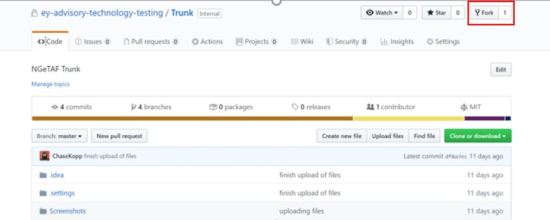

# **Forking your Branch**
* Moving forward, all product teams will work on a forking structure with NGTP
* There will be a main repository located on the Organization repo that will be called Trunk. 
  This repository will have branches for all internal development projects as well as the base branches for all product 
  branches. An example of this is displayed below:


* In order to ensure repo maintenance, only those with organizational owner roles will be allowed to push to these branches. 
  Product team leaders will instead make a forked repository on their own GitHub account for their product team to work in.
* In order to do this simply click the fork button while viewing the repository as shown below:



* This will create a forked copy of the entire repository on your own GitHub Account which you will have control over. 
  An example of this is shown in the picture below:
  


* Once you have forked the repo you will have full control over your forked repository and be able to share the repository 
  with your team as long as they are registered members of the Advisory Technology Testing GitHub organization 
  (restrictions to organization members and requirement of two factor authentication will still be enforced through forks, 
  however you can grant all team members write access to your forked version of the repo)
* Once your fork is set up, you can rebase your main branch to your product and delete all branches besides your product branch
* The rebase function of GitHub allows you to change which branch is considered the main branch of your repo. 
  In a single step,
  1.	First, it saves all your changes in your branch (If you have any)
  2.	It brings all the contents of the master branch into your branch
  3.	If there are no merge conflicts, then it will put all your changes on top of the changes from master
  4.	If there are conflicts, it will ask you resolve them file by file.
* Essentially this will allow you to turn your product branch into your “master” branch
* An example of how to do this follows:
* **First:** Rebase your master branch to whatever product branch your team is working on. This can be easily done in GitHub 
  by going to settings/branch and then switching the default branch to your product branch


* After you have rebased your project you will be free to delete all branches that do not pertain to your team 
  (you can do this by clicking on code and then branch or branches in the top bar where it tells you the number of branches)


* For example, keeping the product branch from source as your master, each analyst you give permissions to can create 
  their own branches as shown in below example


Finally, Setup branch protection rules to ensure analysts cannot push directly to master and for every PR to have 2 
required reviews before merge. Follow the below link to know how to [Enable Required Reviews for Pull Requests](https://help.github.com/en/github/administering-a-repository/enabling-required-reviews-for-pull-requests)

# **Process to create and use forks effectively**
* To create your fork, navigate to the trunk/master in GitHub and select the Fork button on the top right
  corner
* Fork the project into your personal space. Fork should be created under your user name
* Next, Change the name of your repository in settings tab
* Clone this repo on your local system
* Or in Terminal/Git Bash as:
    * `$ git clone <clone path> e.g. $ git clone`
    * `git@github.com:<your_username>/<your_fork_name>.git`
    * `$ cd <project root folder>`
* Next, you need to add a reference back to the original repo by adding a secondary remote called
  upstream. Execute the following:
    * `$ git remote add upstream <master/trunk path>`
    * e.g.
      *` $ git remote add upstream git@github.com:ey-advisory-technologytesting/Trunk.git`
* Once this is set up, you can work with the repo from this point forward. Any time before beginning
  work, however, sync your local repo with the original repo by executing the following:
    * `$ git checkout master` checks out your fork master to your local
      workspace
    * `$ git fetch upstream` Tunes into your original master (for lack
      of a better term)
    * `$ git pull upstream master` Pulls changes from Original master
    *  `$ git commit -m “<message>”` Commits changes
    * `$ git push` Push changes to the Fork master ( You
      will follow all outlined rules regarding PR processes, of course)
* Your local master is now in sync with the upstream master and also has the changes you pushed in now.
  You can now create a branch and make changes, and commit and push your branch to your personal
  fork. When you are ready to push some functionalities back to the original repo, select that as your
  target branch
* Click New Pull Request and select the base repository(the one you forked) and the head repository(the
  fork) and select master on both ends for branches since you want your fork master changes to be
  merged with your Original repo
* **Caution: Commit only the things that are additional capabilities which are generic enough to be**
  **merged upstream. Reviewers need to exercise caution.**

# **Development, Pulls and Pushes**
* After you have created your team’s fork it will be up to you and your team to manage you
  and your teams code before creating a pull request to merge your code back to your
  product branch in organization’s repo
* You may create a pull or push request from any branch in your repo to any branch in the
  organizations main repo as required. They will then be reviewed by the NGeTAF repo
  management team for approval to ensure no code breaks occur. Once submitting a pull or
  push request, email ngetaf.repo.managers@ey.com with information about your request
  and someone will review the request for approval asap
* A best practice for analysts creating new functionality on a fork follows:
1. Analyst clones the master branch into his local
2. Analyst develops new code
3. **Important:** Analyst Must take updates from master before committing changes back
* **Tip:** Use rebase discussed above to do this in a single step instead of doing
  git stack push and git stack pop every time.
4. Analyst commits his changes
5. Analyst pushes his changes to origin/feature/… or origin/fix… branch. The below
   template must be followed for long-term maintenance reasons.
* **Important**
    * E.g. **feature/product1_trading** – If you are pushing a trading functionality for a product branch.
    * **fix/product1_trading_glue_code** – if you are fixing a glue code for
      trading-functionality for a product1.
6. GitHub creates a new branch as created above
7. Analyst creates pull request of new code into master branch of fork
* **Important**
    * All Pull Requests title should be the same as the branch name created
      above. This makes it easier for Owners to investigate PRs and track it down to
      branches or features down the road.
    * The PR should have a description of what was changed.
    * The PR should have a screenshot of unit tests passing or some evidence
      that it did not break existing code.
8. Owner and 1 peer (if team is large enough) review code and approve
* **Important**
    * The PR should be reviewed and approved only after the CI pipeline build
      succeeds.
9. Owner approves pull request to merge code and the development branch (Analyst
   creates new branch off master for next development effort)
* It is also worth noting that all the above repo management procedures can be conducted on
  GitHub desktop as well, and it is strongly recommended to leverage GitHub Desktop to see if
  your team can benefit from its use.
* Once you have your forking structure set up and have created some new functionality that
  you would like to share back with the main NGeTAF repository, simply make sure the code is
  pushed to the main branch of your forked repo’s origin and create a pull request between
  your main branch and the product branch of NGeTAF
* Similarly, if there is an update added to NGeTAF branch from an internal project, those
  updates can be aggregated to your fork either by you or the NGeTAF repo team
* All major releases will require for all product teams to push their finalized code via pull
  request to their product branch on the organization’s repo for the NGeTAF internal
  team to aggregate the code to all branches effectively

NG eTAF Setup

Open cucumber.properties.

# Using a GitHub Hosted Dependency

A lot of our projects/repositories use JARs and libraries which we have deployed right within Github through its GitHub package registry. In order to use them, we need to do some configurations to your maven settings.xml and your GitHub account. Please follow the below steps diligently.

Copy the maven GitHub package dependency of the project being consumed to your pom.xml.

```
<dependency>
  <groupId>GROUP_ID</groupId>
  <artifactId>ARTIFACT_ID</artifactId>
  <version>VERSION</version>
</dependency>
```
### Important!
If you have not done this already,
1. Create a Personal Access Token by navigating to your Github **`profile -> Settings -> Developer Settings -> Personal Access Tokens`**


2. Make sure you **enable the SSO option** next to the token so your IDE can access Github without needing other permissions. (This is very important to allow access to upload/download dependencies)


3. Make sure your IDE is pointing to an installed Maven binary and pointing to the corresponding settings.xml file (By default IntelliJ uses a bundled maven). You can usually find the settings.xml under the conf directory within your maven installation or within your .m2 directory wherever that is.


4. Open your settings.xml file
5. Add an active profile under `<activeProfiles></activeProfiles>`
    ```
    <activeProfiles>
        <activeProfile>github</activeProfile>
    </activeProfiles>
    ```
6. Add a profile for Github under the ```<profiles></profiles>```
    ```
    <profile>
      <id>github</id>
      <repositories>
        <repository>
          <id>central</id>
          <url>https://repo1.maven.org/maven2</url>
          <releases><enabled>true</enabled></releases>
          <snapshots><enabled>true</enabled></snapshots>
        </repository>
        <repository>
          <id>github</id>
          <name>GitHub ey-advisory-technology-testing Apache Maven Packages</name>
          <url>https://maven.pkg.github.com/ey-advisory-technology-testing/*</url>
        </repository>
      </repositories>
    </profile>
    ```

7. Add a server with the Github user name and token under ```<servers></servers>```.
    ```
    <server>
      <id>github</id>
      <username>GITHUB_USERNAME</username>
      <password>TOKEN</password> <!--TOKEN here is basically the Personal Access Token generated in step 1-->
    </server>
    ``` 
**Note:** The id being used is must be the same between the server and the repository in order to tie them together.

