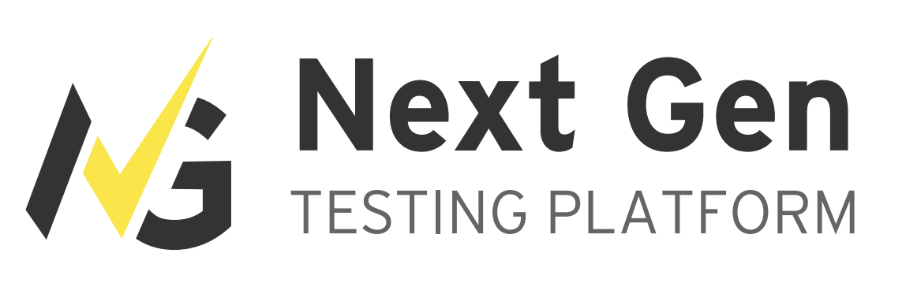

## Home

##  If you are reading this from a PDF file, you can get the latest copy of the documentation from this [link](https://github.com/ey-advisory-technology-testing/NGTP_Docs/wiki)
Welcome to the NextGen Testing Platform wiki! A Description of our pages are as follows:
* **Installation Pre-requisites:** Details on installation and configuration of platform pre-requisites such as java, maven, and IntelliJ IDE
* **Framework Installation:** Details on downloading the framework from GitHub and installing into your IDE
* **Getting Started with NGTP:** Details and illustrations on how to work with Next Gen Testing Platform (NGTP)
* **UI Installation:** Details on downloading the NGTP UI and installing it
* **Getting Started with NGTP UI:** Details and illustrations on how to work with NGTP UI
* **GitHub Usage Guidelines** How to subscribe yourself to get updates on the most recent changes to NGTP
* **Setting up CI Pipelines:** Guide on setting up GitHub Actions CI Pipelines
* **Product Versioning:** Guide on versioning practices to be followed for NGTP updates and releases
* **Integrations:** How to integrate with common 3rd party software
* **Troubleshooting:** Common pitfalls and how to avoid them and fix them

***
