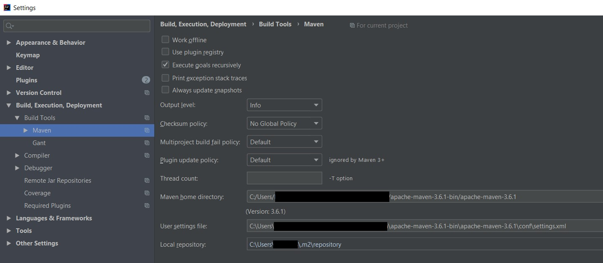
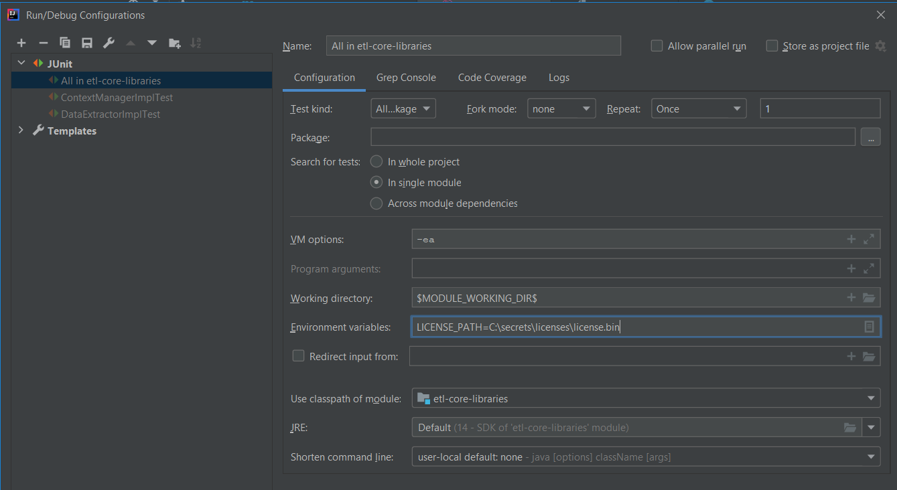

# Installation Prerequisites
## Hardware/Software Requirements

<table>
<tr>
    <th>S.no</th>
    <th>Requirement</th>
    <th>Minimum</th>
    <th>Recommended</th>
    <th>Special Cases</th>
</tr>
<tr>
    <td>1</td>
    <td>Processor</td>
    <td>Dual-Core</td>
    <td>Intel i5</td>
    <td>Intel i7 or quad core for Data/ETL validations</td>
</tr>
<tr>
    <td>2</td>
    <td>RAM</td>
    <td>8GB</td>
    <td>16GB</td>
    <td>32GB or more for Data/ETL validations/ Mac book Pro 32GB preferable</td>
</tr>
<tr>
    <td>3</td>
    <td>Elevated access</td>
    <td>Temporary</td>
    <td>Extended for Testing IE websites</td>
    <td>-</td>
</tr>
</table>

## Install Java JDK
There are 2 options for Java installation
* Open JDK
* Oracle JDK

**Note:** Use Open JDK, unless there is an explicit requirement to use Oracle JDK, as it comes with no-strings-attached and is completely open source. 

### Open JDK
Install OpenJDK14 or above LTS version from [here](https://jdk.java.net/)
JDK 14 or above will be the most compatible. Always use Long Term Support (LTS) versions (jdk 11, 14).

### Oracle JDK
*  **IMPORTANT NOTE:** You must request the “Java Uninstall Exception 1.0” software or else
java may be uninstalled from your computer by EY
* In order to request the exception follow the following directions: 
  * Go to the **EY Appstore** (https://ey.service-now.com/ey/) → Go to **“Order Something”** → click **“Get Software”** → Search **“Java Uninstall Exception 1.0”** → click **“request”**
* Install JDK 14 from https://www.oracle.com/java/technologies/javase-downloads.html
* JDK 11 or above will be the most compatible. Always use Long Term Support (LTS) versions (JDK8, JDK11, JDK14)

## Install Maven
* Download latest version of apache-maven from [here](https://maven.apache.org/download.cgi)
* Unzip the archive to a folder in your local machine
* Versions as old as 2.2 have been tested and work correctly. But we will not support any deprecations and you will have to update to the newer versions

```
**How to set New Environment Variables:**
1. Click the file explorer icon on your computer
2. Right click on "This PC" and select the "Properties" option
3. Click on advanced system settings
4. On the Advanced tab, select Environment Variables, and then click new
5. Furnish the variable name and path. Click OK
```

### Version Control System

#### Subversion

Download and install Tortoise SVN from [TortoiseSVN](https://tortoisesvn.net/downloads.html)

1. Select the latest available stable version for your machine to download (64 bit)
2. Run the program once downloaded and click next through the setup until the custom setup page.
3. Click command line client tools and make sure it is set to "Entire feature will be installed on local hard drive"
4. Click install and click finish

**Subversion Code Checkout**

1. Create a new folder wherever you want to maintain the project repository. Name it as per your preference.
2. Right click the created folder and click svn checkout
3. Enter the URL for the repository and click ok
4. Wait for the download and then verify the folder is not empty

or,

#### Git
Internally, we use GitHub within EY. So this must be your choice if you are installing NGTP within EY network.
- Download Github for desktop app or integrate Git to your IDE
- Download Git from [here](https://git-scm.com/downloads) and install it.
- In IntelliJ, File -> Settings ->Version Control ->Git and set the path for the executable



**Note:** For the merge, fork, mirror, PR and general Github best practices refer the [Github guidelines document](GitHub-Guidelines).

## Setup Environment Variables

1. Setup new variables – Click New
>   * **JAVA_HOME:** <path to your JDK folder containing bin> - e.g **C:\softwares\jdk-14.0.2**
>   * **MAVEN_HOME:** <Path to your Maven folder>-e.g **C:\maven\apache-maven-3.6.3**
>   * **M2_HOME:** <Path to your Maven folder>-e.g **%MAVEN_HOME%**
>   * **M2_REPO:** <Path to your Maven repository>-e.g **C:\Users\<your-username>\.m2\repository**
>   * **LICENSE_PATH:** <Path to your NGTP license.bin file. You need to paste the file in this location and point this environment variable to it>-e.g **C:\Users\<your-username>\licenses\NGTP\license.bin**

2. Add the following to your Path variable if not present already
>   * Maven Bin folder – e.g: **%MAVEN_HOME%\bin**
>   * Java Bin folder – e.g: **%JAVA_HOME%\bin**

**Note:** If you have any other versions of java in your path variables, either remove them or move them down below the above Java path we just set.

**Test if everything works**
* To test if everything is working go to command prompt and type the following
commands to verify the installation and versions are all correct:
  * `where java`
  * `java -version`
  * `where maven`
  * `maven -version`
**Note:** All of them should give the versions of the most recently installed software. If not revisit the steps above and check if you missed any.

## Download and setup IntelliJ Community Version and its dependencies
* Download IntelliJ Community Version and its dependencies from https://www.jetbrains.com/idea/download/#section=windows
* Click next through all the setup instructions. Click finish at the end. Required version:
2019.2.2 or later
* In order for NG Testing Platform to run correctly in your IntelliJ environment, be sure to
install the following plugins from the IntelliJ Marketplace:
  * Cucumber for Java Plugin for IntelliJ (IntelliJ Idea Marketplace, Open IntelliJ → File → Settings → Plugins)
    * Recommended Version: latest
  * Gherkin Plugin for IntelliJ (IntelliJ Idea Marketplace, Open IntelliJ → File → Settings → Plugins)
    * Recommended Version: latest
  * YAML/ANSIBLE Plugin for IntelliJ (IntelliJ Idea Marketplace, Open IntelliJ  File → Settings → Plugins)
    * Recommended Version: latest

### Configuring your IntelliJ to SSO into GitHub (Internal only)
In order for you to clone your projects, push and pull from GitHub every time without having to enter your user name password, you need to configure Secure Shell (SSH) on your machine and provide GitHub with that details. This will enable GitHub and your machine to communicate securely without you needing to authorize yourself. More details on this can be found [here](https://www.ssh.com/ssh/)

The GitHub website has laid down the steps to generate an SSH key. Please follow the [instructions](https://docs.github.com/en/github/authenticating-to-github/generating-a-new-ssh-key-and-adding-it-to-the-ssh-agent) diligently to set up SSH and add the key to your GitHub Settings. Do not forget to enable SSO after creating SSH. Once you have done this, you will be able to clone the projects using SSH links instead of the https URLs.

Now, navigate to `File -> Settings -> Version Control` and select GitHub. Click the + sign on the right side and select `Login via GitHub` option and follow the prompts to get SSO access to GitHub from IntelliJ. Below the window, check the checkbox that says:

- [x] clone git repositories using ssh.


## Obtaining and Configuring NGTP License
### Activation Required
The library is license restricted with a digitally-signed EY license. You will need a license file or, a license token added to your environment variables to activate the tool. Get a limited duration license from our <a href="mailto:874d64a4.EYGS.onmicrosoft.com@amer.teams.ms?subject=NGTP%20License%20Request&body=Please%20provide%20a%20limited%20NGTP%20license.%20Below%20are%20the%20details:%0D%0A1.Name:%0D%0A2.Business%20case:%0D%0A3.Engagement%20Duration:">NGTP License Administrators</a>. Email them the following details to help create your license
* Your full name
* Business case
* Engagement duration (for client projects)

If given a license file,it to a secure location in your file system and note down the path. Provide the path in your environment variables in the below format. Details are provided in the [above](#setup-environment-variables).

<table>
<tr>
    <th>Key</th>
    <th>Value</th>
</tr>
<tr>
    <td>LICENSE_PATH</td>
    <td>YOUR LICENSE FILE PATH</td>
</tr>
</table>

**Note:** Alternative way if you cannot access environment variables, if you are running locally in IntelliJ, you can go to `Edit configurations > Environment Variables` (under configuration tab) and save the key value pair as LICENSE_PATH=<token value>




