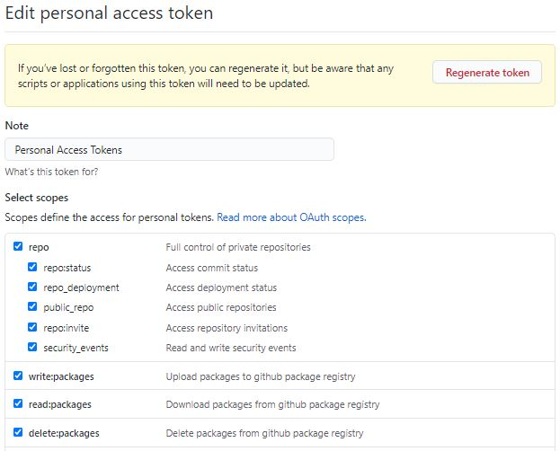
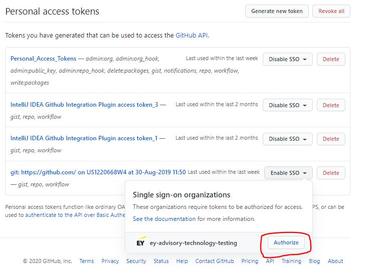
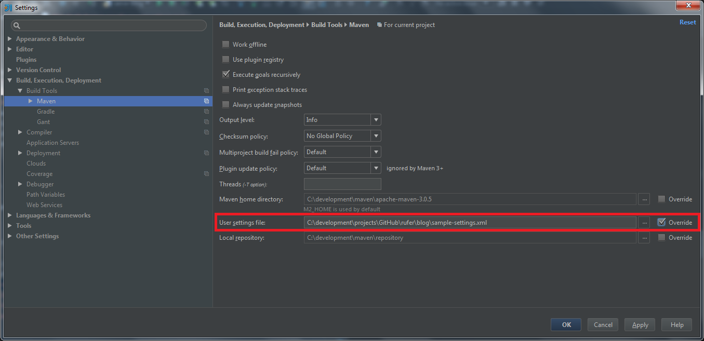

# How to Download Dependencies hosted in GitHub Packages

A lot of our projects/repositories use JARs and libraries which we have deployed right within Github through its GitHub package registry. In order to use them, we need to do some configurations to your maven settings.xml and your GitHub account. Please follow the below steps diligently.

Copy the maven GitHub package dependency of the project being consumed to your pom.xml. 

```
<dependency>
  <groupId>GROUP_ID</groupId>
  <artifactId>ARTIFACT_ID</artifactId>
  <version>VERSION</version>
</dependency>
```
### Important!
If you have not done this already,
1. Create a Personal Access Token by navigating to your Github **`profile -> Settings -> Developer Settings -> Personal Access Tokens`**

 

2. Make sure you **enable the SSO option** next to the token so your IDE can access Github without needing other permissions. (This is very important to allow access to upload/download dependencies)


 
3. Make sure your IDE is pointing to an installed Maven binary and pointing to the corresponding settings.xml file (By default IntelliJ uses a bundled maven). You can usually find the settings.xml under the conf directory within your maven installation or within your .m2 directory wherever that is.



4. Open your settings.xml file
5. Add an active profile under `<activeProfiles></activeProfiles>`
    ```
    <activeProfiles>
        <activeProfile>github</activeProfile>
    </activeProfiles>
    ```
6. Add a profile for Github under the ```<profiles></profiles>```
    ```
    <profile>
      <id>github</id>
      <repositories>
        <repository>
          <id>central</id>
          <url>https://repo1.maven.org/maven2</url>
          <releases><enabled>true</enabled></releases>
          <snapshots><enabled>true</enabled></snapshots>
        </repository>
        <repository>
          <id>github</id>
          <name>GitHub ey-advisory-technology-testing Apache Maven Packages</name>
          <url>http://maven.pkg.github.com/ey-advisory-technology-testing/*</url>
        </repository>
      </repositories>
    </profile>
    ```
  
7. Add a server with the Github user name and token under ```<servers></servers>```.
    ```
    <server>
      <id>github</id>
      <username>GITHUB_USERNAME</username>
      <password>TOKEN</password> <!--TOKEN here is basically the Personal Access Token generated in step 1-->
    </server>
    ``` 
**Note:** The id being used is must be the same between the server, and the repository in order to tie them together.

Your final settings file should look something like the one below:
```<?xml version="1.0" encoding="UTF-8"?>
<settings>
   <activeProfiles>
      <activeProfile>github</activeProfile>
   </activeProfiles>
   <profiles>
      <profile>
         <id>github</id>
         <repositories>
            <repository>
               <id>github</id>
               <name>GitHub ey-advisory-technology-testing Apache Maven Packages</name>
               <url>https://maven.pkg.github.com/ey-advisory-technology-testing/*</url>
            </repository>
            <repository>
               <id>central</id>
               <url>https://repo1.maven.org/maven2</url>
               <releases>
                  <enabled>true</enabled>
               </releases>
               <snapshots>
                  <enabled>true</enabled>
               </snapshots>
            </repository>
         </repositories>
      </profile>
   </profiles>
   <servers>
      <server>
         <id>github</id>
         <username>GitHub Username</username>
         <password>Personal Access Token</password>
      </server>
   </servers>
</settings>
```

***