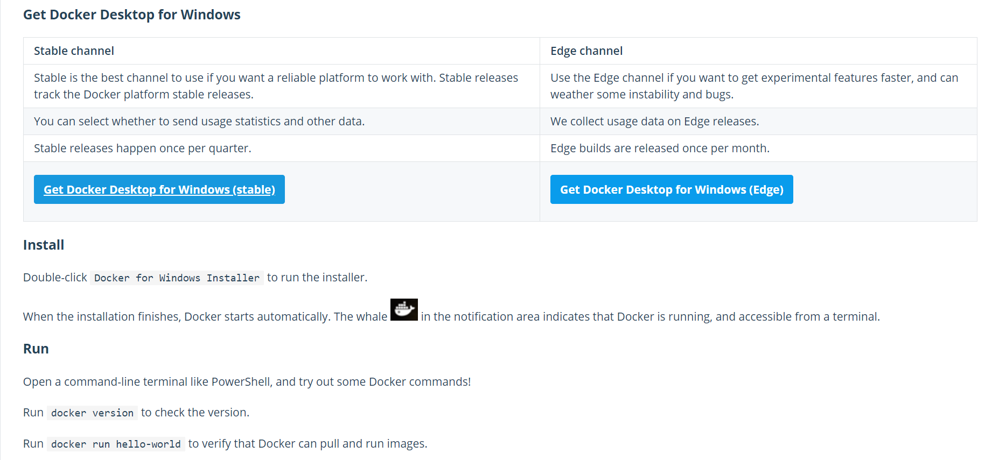
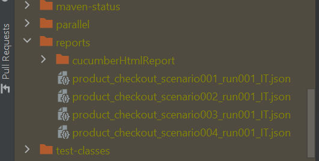
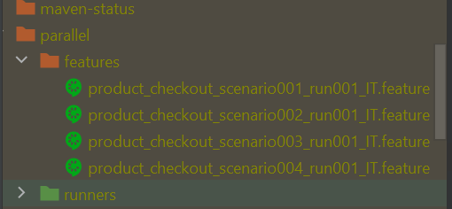

# Zalenium in NG TP for Windows


### Software Requirements
* Java 11 or higher - https://jdk.java.net/
* Maven 3.6.3 or higher - https://maven.apache.org/download.cgi
* Next Gen Testing Platform - https://github.com/ey-advisory-technology-testing/Trunk
* Docker for windows

### Installing Docker for Windows
   1. Go to [docker-ce-desktop-windows link](https://hub.docker.com/editions/community/docker-ce-desktop-windows) and click on “Get Docker Desktop for Windows”

   

   1. When the installation finishes, Docker starts automatically. The whale in the notification area indicates that Docker is running, and accessible from a terminal.
      * Restart your pc if Docker does not start automatically after installation.
   2. Open Windows PowerShell and run "docker version" to check the version
      * Run "docker info" and make sure it works without error

### Setting up Zalenium


   1. Open Windows PowerShell and run the following commands (one line for each bullet)

```
   docker pull elgalu/selenium
   docker pull dosel/Zalenium
   **Windows OS :** 
   docker run --rm -ti --name zalenium -p 4444:4444 -v /var/run/docker.sock:/var/run/docker.sock -v /c/Users/your_user_name/temp/videos:/home/seluser/videos --privileged dosel/zalenium start
   **Mac OS :** docker run --rm -ti --name zalenium -p 4444:4444 -v /var/run/docker.sock:/var/run/docker.sock -v /tmp/videos:/home/seluser/videos --privileged dosel/zalenium start
```

### NG TP Configuration for Zalenium 
1. Open cucumber.properties. (\src\main\resources\cucumber.properties)
2. Change the grid and gridURL values as below
```
   grid=true 
   gridURL= http://localhost:4444/wd/hub
```
3. Open the pom.xml file (\pom.xml) and make below changes.

   - Update the application name as the relevant test name

```
<.application>amazonDemo</application>
```

   - Make sure source.feature has the below entry

```
<source.feature>${project.basedir}/src/test/resources/${application}/features</source.feature>
```
4. Scroll down to the cucable-plugin block in pom.xml and crosscheck the entries

5. Make sure `"<sourceRunnerTemplateFile>"` is the same as below:
    (more details about the sourceRunnerTemplateFile is mentioned below as part of cucable documentation.)

   ```
    <sourceRunnerTemplateFile>
            ${project.basedir}/src/test/java/methods/CucableJavaTemplate.java
    </sourceRunnerTemplateFile> 
   ```

   1. Change the <sourceFeatures> location to the location of your feature files that contains the tests you want to test in parallel.  
            <sourceFeatures>${source.feature}</sourceFeatures>

   2. Change the <includeScenarioTags> to the tag you will use for parallel tests
    ```
    <includeScenarioTags>@grid</includeScenarioTags>
    ```

   3. parellelizationMode set as scenarios ensures feature files are split into individual scenarios whereas parellelizationMode set as features ensures features are run in parallel.

```
        <parallelizationMode>scenarios</parallelizationMode>
        <plugin>
            <groupId>com.trivago.rta</groupId>
            <artifactId>cucable-plugin</artifactId>
            <version>1.8.0</version>
            <executions>
               <execution>
                  <id>generate-test-resources</id>
                  <phase>generate-test-resources</phase>
                  <goals>
                     <goal>parallel</goal>
                  </goals>
               </execution>
            </executions>
            <configuration>
               <!-- This can be either a Java class file or a text based template -->
               <sourceRunnerTemplateFile>${project.basedir}/src/test/java/methods/CucableJavaTemplate.java</sourceRunnerTemplateFile>
               <!--<sourceRunnerTemplateFile>src/test/resources/cucable.template</sourceRunnerTemplateFile>-->

               <!-- process all tests in the given directory -->
               <sourceFeatures>${source.feature}</sourceFeatures>

               <!-- process a specific feature file in the given directory -->
               <!--<sourceFeatures>${project.basedir}/src/test/resources/amazonDemo/features</sourceFeatures>-->

               <!-- process multiple feature files -->
               <!--<sourceFeatures>-->
               <!--src/test/resources/features/testfeature2,-->
               <!--src/test/resources/features/testfeature/MyTest8.feature-->
               <!--</sourceFeatures>-->

               <!-- process a specific feature file and specific line numbers in the given directory -->
               <!--<sourceFeatures>src/test/resources/features/testfeature/MyTest1.feature:8:19</sourceFeatures>-->

               <generatedFeatureDirectory>${generated.feature.directory}</generatedFeatureDirectory>
               <generatedRunnerDirectory>${generated.runner.directory}</generatedRunnerDirectory>

               <!-- optional: custom data that is available in Cucable placeholders in a template -->
               <!--<customPlaceholders>-->
               <!--<comment>This should appear inside the template</comment>-->
               <!--</customPlaceholders>-->

               <!-- optional: Cucumber tag expression to include or exclude scenarios with certain tags (see https://docs.cucumber.io/cucumber/api/#tag-expressions) -->
               <!--<includeScenarioTags>${tags}</includeScenarioTags>-->
               <includeScenarioTags>@grid</includeScenarioTags>
               <!--<includeScenarioTags>(@scenario1Tag1 or @scenario1Tag2) and not @skipMe</includeScenarioTags>-->

               <!-- optional: change parallelization mode of Cucable (default: 'scenarios')-->
               <!-- <parallelizationMode>scenarios</parallelizationMode>-->
               <parallelizationMode>scenarios</parallelizationMode>

               <!-- optional: number of test runs to create runners and features multiple times
                         if set to a number greater than 1 -->
               <!--<numberOfTestRuns>1</numberOfTestRuns>-->

               <!-- optional: generate a fixed number of runners and distribute all features round-robin.
                     This can only be used if desiredNumberOfFeaturesPerRunner is NOT used! -->
               <!--<desiredNumberOfRunners>2</desiredNumberOfRunners>-->

               <!-- optional: distribute a fixed number features per runner round-robin.
                    This can only be used if desiredNumberOfRunners is NOT used! -->
               <!--<desiredNumberOfFeaturesPerRunner>4</desiredNumberOfFeaturesPerRunner>-->

               <!-- optional: Cucable log level -->
               <logLevel>default</logLevel>
               <!--<logLevel>compact</logLevel>-->
               <!--<logLevel>minimal</logLevel>-->
               <!--<logLevel>off</logLevel>-->
            </configuration>
         </plugin>
```

6. Make sure "sourceRunnerTemplateFile" node is same as below:
(more details about the "sourceRunnerTemplateFile" is mentioned below as part of cucable documentation.)
           
```
         <sourceRunnerTemplateFile>
             ${project.basedir}/src/test/java/methods/CucableJavaTemplate.java
         </sourceRunnerTemplateFile>
 ```
7. Change the sourceFeatures node location to the location of your feature files that contains the tests you want to test in parallel.      
		    
```
		<sourceFeatures>${source.feature}</sourceFeatures>
```
8. Change the includeScenarioTags node to the tag you will use for parallel tests

```
		<includeScenarioTags>@grid</includeScenarioTags>
```
9. Make sure the parellelizationMode node is set as scenarios so that the feature files are split into individual scenarios and each have a dedicated runner.
   		
```
            <parallelizationMode>scenarios</parallelizationMode>
```
		
10. Open the CucableJavaTemplate.java file. (Next to FunctionalCukesTests) (\src\test\java\methods\CucableJavaTemplate.java)
    * Change the tag to the same tag used for includeScenarioTags node above.
    * @CucumberOptions(  tags = {"@grid"},
        
11.	Make sure all the following have the same tag:
    <includeScenarioTags>@grid</includeScenarioTags>
    @CucumberOptions(tags={"@grid"},
    Feature Scenarios  (eTAF\project_name\src\test\resources\<your-application>>\features)
 ```
        Feature:  Ordering a product in Amazon
          @zenbook @parallel @grid
          Scenario: Verify Asus Zenbook laptop is available in product catalog
            Given I navigate to amazon.home page
            Then I enter "electronics" into input field amazon.search_bar
            Then I click on element amazon.search_button
            Then I should see page title as "Amazon.com: Electronics"
            Then I enter "ASUS Zenbook 13" into input field amazon.search_bar
            Then I click on element amazon.search_button
            Then I should see page title as "Amazon.com : ASUS Zenbook 13"
            Then I click on element searchpage.asus_zenbook
            Then element productpage.product_title should have partial text as "ASUS ZenBook 13"
        
          @pixelbook @parallel @grid
          Scenario: Verify Google Pixelbook laptop is available in product catalog
            Given I navigate to amazon.home page
            Then I enter "electronics" into input field amazon.search_bar
            Then I click on element amazon.search_button
            Then I should see page title as "Amazon.com: Electronics"
            Then I enter "Google Netbook 11" into input field amazon.search_bar
            Then I click on element amazon.search_button
            Then I should see page title as "Amazon.com : Google Netbook 11"
            Then I click on element searchpage.google_netbook
            Then element productpage.product_title should have partial text as "Pixelbook"
```

### Cucable Documentation
Cucable cuts up the feature file into the smallest possible runnable scenarios. Each generated feature file includes a single scenario. After this, the runner classes for those generated features are generated based on a provided template file.

1. sourceRunnerTemplateFile - e.g. : CucableJavaTemplate (\eTAF\<project_name>\src\test\java\methods\CucableJavaTemplate.java)
   1.	This file is used to generate runner classes for the generated feature file that can be run using Maven Failsafe .


```
       package methods;   
       import cucumber.api.CucumberOptions;
       import cucumber.api.junit.Cucumber;
       import org.junit.runner.RunWith;
       
       @CucumberOptions(
               tags = {"@grid"},
               plugin = {"pretty", "html:target/reports/cucumberHtmlReport", "json:target/reports/[CUCABLE:RUNNER].json"},
               features = {"target/parallel/features/[CUCABLE:FEATURE].feature"},
               glue = {"seleniumutils.applicationlayer", "seleniumutils.frameworklayer", "methods", "stepimplementation","application", "business"}
       )
       @RunWith(Cucumber.class)
       //Junit
       public class CucableJavaTemplate {
       
       }
```

   2. [CUCABLE:RUNNER] is placed in plugin option of the **@CucumberOptions** to generate reports. The [CUCABLE:RUNNER] template placeholder is automatically replaced with the class name of the generated runner class. When the generated runner runs single/multiple scenarios its name would be in the format: <feature_name>_scenario001_run001_IT.


    

   3. The [CUCABLE:FEATURE] is placed in the feature option of the @CucumberOptions block in your template. Cucable will automatically detect the string containing the [CUCABLE:FEATURE] placeholder and use this to generate one line for each feature this runner should trigger.

   

   4. includeScenarioTags from pom.xml is used to provide a Cucumber tag expression in order to specify which tags should be included or excluded from scenario generation. The includeScenarioTags value (@grid) should be specified in the tag option of the @CucumberOptions block in your template.

   5. Refer the below link for more information regarding the cucable-plugin: "trivago/cucable-plugin: Maven plugin that simplifies running Cucumber Scenarios in parallel. (github.com)"


