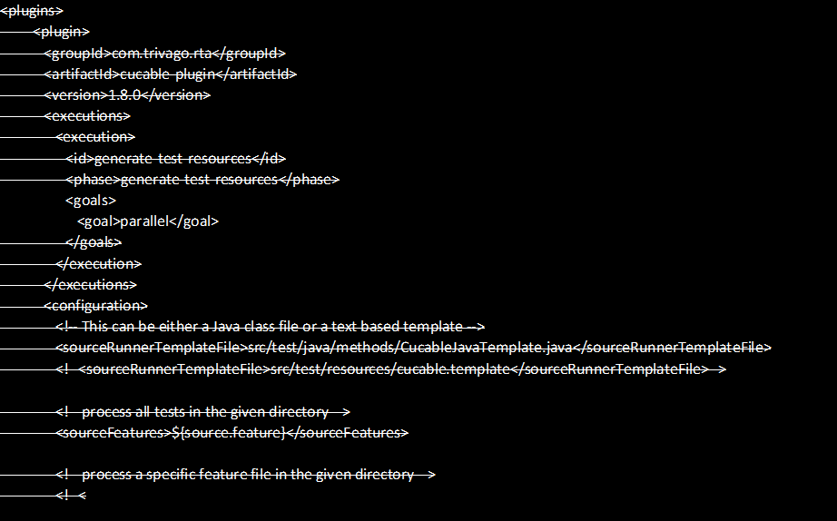
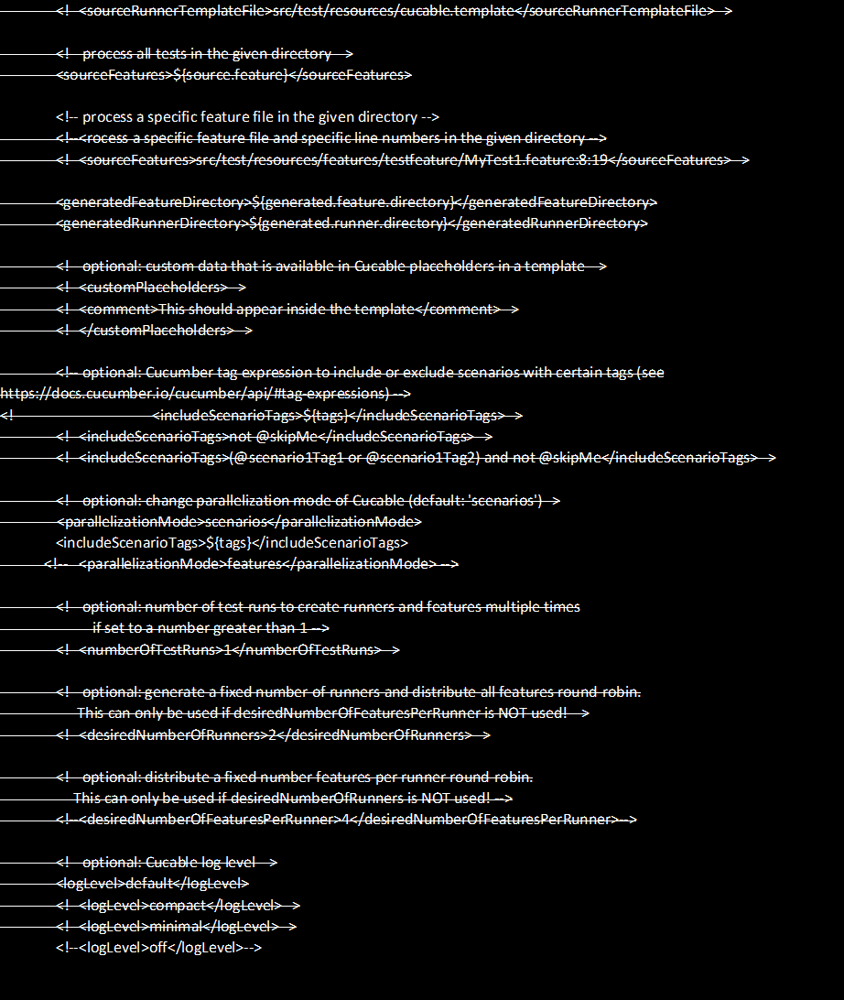
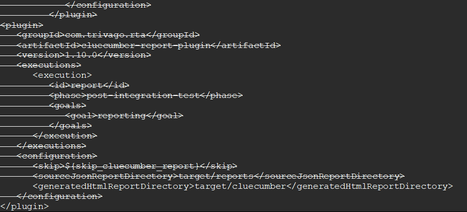

# Removal of Cucable

## FunctionalCukesTest:

1. Move FunctionalCukesTest to src/test/java/stepimplementation
2. Change package to stepimplementation
3. Change import statements from

import io.cucumber.junit.CucumberOptions; to

import io.cucumber.testng.CucumberOptions;

## CucableJavaTemplate:

Remove this file

## Pom.xml:

Remove cucable plugin from pom.xml








Change Maven Failsafe and surefire as below
```
    <plugin>
      <groupId>org.apache.maven.plugins</groupId>
      <artifactId>maven-surefire-plugin</artifactId>
      <version>3.0.0-M3</version>
      <configuration>
         <includes>
            <include>**/unit-tests/*Test.java</include>
            <include>**/FunctionalCukesTest.java</include>
         </includes>
         <properties>
            <property>
               <name>junit</name>
               <value>false</value>
            </property>
         </properties>
         <parallel>methods</parallel>
         <threadCount>2</threadCount>
      </configuration>
    </plugin>
    <plugin>
      <groupId>org.apache.maven.plugins</groupId>
      <artifactId>maven-failsafe-plugin</artifactId>
      <version>3.0.0-M3</version>
      <executions>
         <execution>
            <id>Run parallel tests</id>
            <phase>integration-test</phase>
            <goals>
               <goal>integration-test</goal>
            </goals>
         </execution>
      </executions>
      <configuration>
         <properties>
            <property>
               <name>parallel</name>
               <value>methods</value>
            </property>
            <property>
               <name>dataproviderthreadcount</name>
               <value>30</value>
            </property>
         </properties>
            <includes>
               <include>**/unit-tests/*Test.java</include>
               <include>**/FunctionalCukesTest.java</include>
            </includes>
         <testFailureIgnore>true</testFailureIgnore>
         <reuseForks>false</reuseForks>
         <argLine>-Dfile.encoding=UTF-8</argLine>
         <disableXmlReport>true</disableXmlReport>
      </configuration>
    </plugin>
```